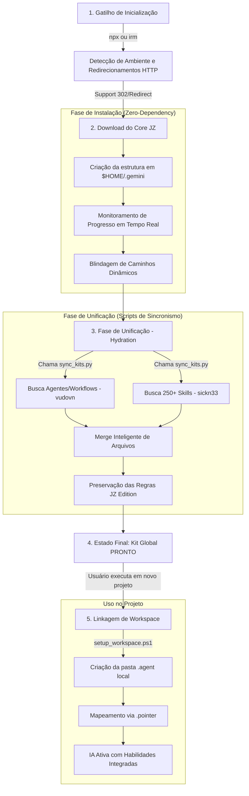

# 📊 Fluxograma Cronológico de Operação - Antigravity Kit (JZ Edition)

Este documento descreve a linha do tempo exata, desde o comando inicial até a ativação da IA em um projeto.

---

## 1. Fluxo Cronológico (Lifecycle)

---

## 2. Detalhamento dos Estágios

### Estágio 1: O Gatilho e a Rede
Tudo começa com o comando de uma linha. O instalador agora é inteligente: ele detecta redirecionamentos do GitHub (302), possui timeouts de segurança (60s) e fornece feedback visual constante para garantir que a instalação não "trave" silenciosamente.

### Estágio 2: A Fundação (Portabilidade Total)
Nesta fase, o instalador cria a estrutura de diretórios e extrai o "cérebro" do sistema. A lógica foi blindada para ignorar nomes de pastas dinâmicas (ex: `antigravity-jz-rm-main`), garantindo que o kit funcione em qualquer máquina desde a primeira execução ("Zero-Dependency").

### Estágio 3: A Unificação (O Pulo do Gato)
O script `sync_kits.py` entra em ação automaticamente:
1. Ele busca a orquestração de agentes do repositório **Vudovn**.
2. Ele busca as centenas de habilidades do repositório **Awesome Skills**.
3. Ele realiza o **Merge**: Insere as peças baixadas preservando o `GEMINI.md` e os scripts do JZ Edition como soberanos.

### Estágio 4: O Kit Global
Agora a máquina tem uma biblioteca completa (Kit Original + Skills + Regras JZ) centralizada na pasta do usuário (`$HOME`). Ela está pronta para ser usada por qualquer projeto na mesma máquina.

### Estágio 5: Ativação no Projeto
Ao iniciar um código novo:
- O `setup_workspace.ps1` (agora restaurado no repositório) vincula o projeto local à instalação global.
- O mapeamento via `.pointer` permite que a IA localize as habilidades globais.
- **Final:** A IA lê o `GEMINI.md` e o kit é ativado com superpoderes.

---

## 3. Resultado Final
Ao final deste fluxo, o usuário tem um assistente de IA que:
- Segue as regras do **JZ Edition**.
- Possui o conhecimento das **250+ Skills**.
- É **100% resiliente a rede e ambiente**.
- Possui **instalação assistida com feedback de progresso**.
