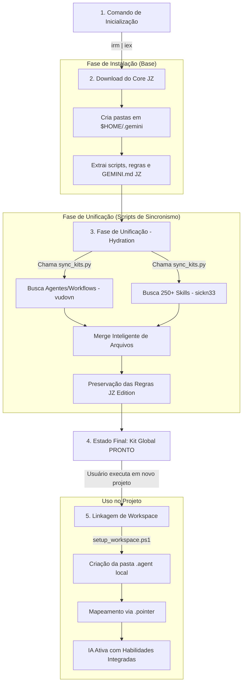

# 📊 Fluxograma Cronológico de Operação - Antigravity Kit (JZ Edition)

Este documento descreve a linha do tempo exata, desde o comando inicial até a ativação da IA em um projeto.

---

## 1. Fluxo Cronológico (Lifecycle)

---

## 2. Detalhamento dos Estágios

### Estágio 1: O Gatilho
Tudo começa com o comando de uma linha no terminal. Ele é o ponto de entrada que prepara o ambiente e solicita os recursos iniciais do repositório **Academico-JZ/antigravity-jz**.

### Estágio 2: A Fundação (Base JZ)
Nesta fase, o instalador cria a estrutura de diretórios necessária e baixa o "cérebro" do sistema: o seu `GEMINI.md` personalizado e os scripts de portabilidade. **Neste momento, o kit ainda está "vazio" de habilidades externas.**

### Estágio 3: A Unificação (O Pulo do Gato)
O script `sync_kits.py` entra em ação automaticamente (ou via trigger):
1. Ele viaja até o repositório original do **Vudovn** e busca a orquestração de agentes.
2. Ele viaja até o repositório **Awesome Skills** e busca as centenas de habilidades.
3. Ele realiza o **Merge**: Insere as peças baixadas dentro da sua instalação, mas mantém o `GEMINI.md` e os scripts do JZ Edition como as regras soberanas.

### Estágio 4: O Kit Global
Agora a máquina tem uma biblioteca completa (Kit Original + Skills + Regras JZ) centralizada na pasta de usuário (`$HOME`). Ela está pronta para ser usada por qualquer projeto na mesma máquina.

### Estágio 5: Ativação no Projeto
Quando você inicia um código novo:
- O `setup_workspace.ps1` é executado na pasta do projeto.
- Ele "virtualiza" o kit, criando um vínculo entre o projeto local e a instalação global.
- **Final:** A IA entra no projeto, lê os arquivos de linkagem e passa a ter acesso a tudo o que foi unificado nas fases anteriores.

---

## 3. Resultado Final
Ao final deste fluxo, o usuário tem um assistente de IA que:
- Segue as regras do **JZ Edition**.
- Usa a estrutura do **Kit Original**.
- Possui o conhecimento das **250+ Skills**.
- É **portátil** e fácil de atualizar.
